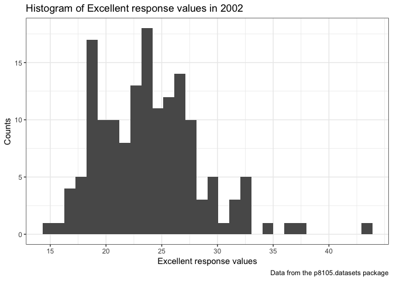
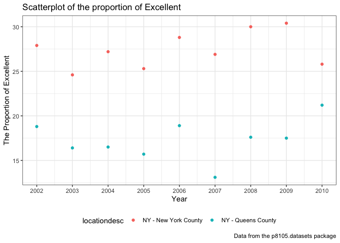

p8105\_hw2\_hx2263
================
Tiffany Xi
2018-09-27

Problem 1
=========

Import and clean NYC transit csv files

``` r
nyc_transit = 
  read_csv(file = "./data/NYC_Transit_Subway_Entrance_And_Exit_Data.csv") %>% 
  janitor::clean_names() %>% 
  select(line:entry, vending, ada) %>% 
  mutate(entry = recode(entry, "YES" = TRUE, "NO" = FALSE))
```

*Description:*

This nyc\_transit dataset contains 19 variables, which are named line, station\_name, station\_latitude, station\_longitude, route1, route2, route3, route4, route5, route6, route7, route8, route9, route10, route11, entrance\_type, entry, vending, ada.

My data cleaning steps are: first import the data and clean the column names into snake case with function janitor::clean\_names; then use 'select' function to select the variables I am interested in. Subsequently, use recode to convert the character variable 'YES' and 'NO' in 'entry' column into logical variable 'TRUE' and 'FALSE'.

The dimension of the resulting dataset is 1868 rows \* 19 columns. I think these data are untidy, we need to put all routes into one column.

-   Answers:

1.  There are 465 distinct stations.

2.  The number of disctinct stations which are ADA compliant is 84. From the original dataset, the number of stations which are ADA compliant is 468.

3.  The proportion of station entrances / exits without vending allow entrance is 0.3770492.

-   Reformat data

*1.* route number and route name are distinct variables

``` r
nyc_transit_tidy = 
  nyc_transit %>% 
  gather(key = "route_number", value = "route_name", route1:route11) %>% 
  separate(route_number, into = c("route_str", "route_num"), sep = 5) %>% 
  select(-route_str)
nyc_transit_tidy
```

    ## # A tibble: 20,548 x 10
    ##    line  station_name station_latitude station_longitu… entrance_type entry
    ##    <chr> <chr>                   <dbl>            <dbl> <chr>         <lgl>
    ##  1 4 Av… 25th St                  40.7            -74.0 Stair         TRUE 
    ##  2 4 Av… 25th St                  40.7            -74.0 Stair         TRUE 
    ##  3 4 Av… 36th St                  40.7            -74.0 Stair         TRUE 
    ##  4 4 Av… 36th St                  40.7            -74.0 Stair         TRUE 
    ##  5 4 Av… 36th St                  40.7            -74.0 Stair         TRUE 
    ##  6 4 Av… 45th St                  40.6            -74.0 Stair         TRUE 
    ##  7 4 Av… 45th St                  40.6            -74.0 Stair         TRUE 
    ##  8 4 Av… 45th St                  40.6            -74.0 Stair         TRUE 
    ##  9 4 Av… 45th St                  40.6            -74.0 Stair         TRUE 
    ## 10 4 Av… 53rd St                  40.6            -74.0 Stair         TRUE 
    ## # ... with 20,538 more rows, and 4 more variables: vending <chr>,
    ## #   ada <lgl>, route_num <chr>, route_name <chr>

*2.* 60 distinct stations serve the A train.

*3.* Of the stations that serve the A train, 17 of them are ADA compliant.

Problem 2
=========

1.Read and clean the Mr. Trash Wheel sheet.

``` r
trash_wheel = 
  readxl::read_excel(path = "./data/HealthyHarborWaterWheelTotals2018-7-28.xlsx", 
                     sheet = "Mr. Trash Wheel", 
                     range = "A2:N338") %>%
  janitor::clean_names() %>% 
  filter(!is.na(dumpster)) %>% 
  mutate(sports_balls = round(sports_balls, digits = 0)) %>% 
  mutate(sports_balls = as.integer(sports_balls))
```

2.Read and clean precipitation data for 2016 and 2017

``` r
prcp_2016 = 
  readxl::read_excel(path = "./data/HealthyHarborWaterWheelTotals2018-7-28.xlsx",
                     sheet = "2016 Precipitation", 
                     range = "A2:B15") %>% 
  janitor::clean_names() %>% 
  filter(!is.na(month)) %>% 
  filter(!is.na(total)) %>% 
  mutate(year = 2016) 

prcp_2017 = 
  readxl::read_excel(path = "./data/HealthyHarborWaterWheelTotals2018-7-28.xlsx",
                     sheet = "2017 Precipitation", 
                     range = "A2:B15") %>% 
  janitor::clean_names() %>% 
  filter(!is.na(month)) %>% 
  filter(!is.na(total)) %>% 
  mutate(year = 2017) 
```

3.Combine datasets and convert month to a character variable

``` r
combo_16_17 = bind_rows(prcp_2016, prcp_2017) %>% 
  mutate(month = month.name[month])
combo_16_17
```

    ## # A tibble: 24 x 3
    ##    month     total  year
    ##    <chr>     <dbl> <dbl>
    ##  1 January    3.23  2016
    ##  2 February   5.32  2016
    ##  3 March      2.24  2016
    ##  4 April      1.78  2016
    ##  5 May        5.19  2016
    ##  6 June       3.2   2016
    ##  7 July       6.09  2016
    ##  8 August     3.96  2016
    ##  9 September  4.53  2016
    ## 10 October    0.62  2016
    ## # ... with 14 more rows

-   Description:

In the dataset `trash_wheel`, the number of observations is 285, and the number of variables is 14.

-   Key variables are `dumpster`, `glass_bottles`,`grocery_bags` and etc.

1.The mean of the number of glass bottles in 2014, 2015, 2016 are 46.75, 32.77 and 40.35.

2.The median of the number of grocery bags in 2015, 2016, 2017 are 1340, 2210 and 1950.

3.The maximum of the number of cigarette butts in the year 2015 is 8.210^{4}.

In the precipitation dataset `combo_16_17`, the number of observations is 24, and the number of variables is 3.

-   Key variables are `month`, `total` and `year`.

1.The mean of precipitation data in year 2016 is 3.33.

2.The median of precipitation data in year 2017 is 2.145.

3.The standard deviation of precipitation data in year 2016 is 1.71.

-   For available data, the total precipitation in 2017 was 32.93 inches.

-   The median number of sports balls in a dumpster in 2016 was 26.

Problem 3
=========

Load the data from the p8105.datasets package

``` r
devtools::install_github("p8105/p8105.datasets")
library(p8105.datasets)
```

Clean the data and reformat according to requirement below:

1.  Format the data to use appropriate variable names;
2.  Focus on the “Overall Health” topic
3.  Exclude variables for class, topic, question, sample size, and everything from lower confidence limit to GeoLocation
4.  Structure data so that values for Response are column names / variables which indicate the proportion of subjects with each response
5.  Create a new variable showing the proportion of responses that were “Excellent” or “Very Good”

``` r
brfss = brfss_smart2010 %>% 
  janitor::clean_names() %>% 
  filter(topic == "Overall Health") %>% 
  select(-class, -topic, -question, -sample_size, -(confidence_limit_low:geo_location)) %>%
  spread(key = response, value = data_value) %>%
  janitor::clean_names() %>% 
  select("year", "locationabbr", "locationdesc", "excellent", "very_good", "good", "fair", "poor") %>% 
  mutate(prop_ex_vg = (excellent + very_good))
```

-   Answers:

What state is observed the most?

``` r
which.max(table(brfss$locationabbr))
```

    ## NJ 
    ## 32

-   404 unique locations are included in the dataset. The number of states are 51, so, yes, every state is represented. NJ(New Jersey) is observed the most.

-   In 2002, the median of the “Excellent” response value is 23.6.

-   Histogram of “Excellent” response values in the year 2002

``` r
brfss %>% 
  filter(year == 2002) %>% 
  ggplot(aes(x = excellent)) + 
  geom_histogram() +
  labs(
    title = "Histogram of Excellent response values in 2002",
    x = "Excellent response values",
    y = "Counts",
    caption = "Data from the p8105.datasets package"
  ) +
  scale_x_continuous(breaks = c(15, 20, 25, 30, 35, 40), 
                     labels = c("15", "20", "25", "30", "35", "40")) +
  theme_bw()
```



-   Scatterplot of the proportion of “Excellent” response values in New York County and Queens County (both in NY State) in each year from 2002 to 2010

``` r
brfss %>% 
  filter(locationabbr == "NY") %>% 
  filter(locationdesc == "NY - New York County" | locationdesc == "NY - Queens County") %>% 
  ggplot(aes(x = year, y = excellent)) + 
  geom_point(aes(color = locationdesc)) +
  labs(
    title = "Scatterplot of the proportion of Excellent ",
    x = "Year",
    y = "The Proportion of Excellent",
    caption = "Data from the p8105.datasets package"
  ) +
  scale_x_continuous(breaks = c(2002, 2003, 2004, 2005, 2006, 
                                2007, 2008, 2009, 2010), 
                     labels = c("2002", "2003", "2004", "2005", "2006", 
                                "2007", "2008", "2009", "2010")) +
  theme_bw() +
  theme(legend.position = "bottom")
```


